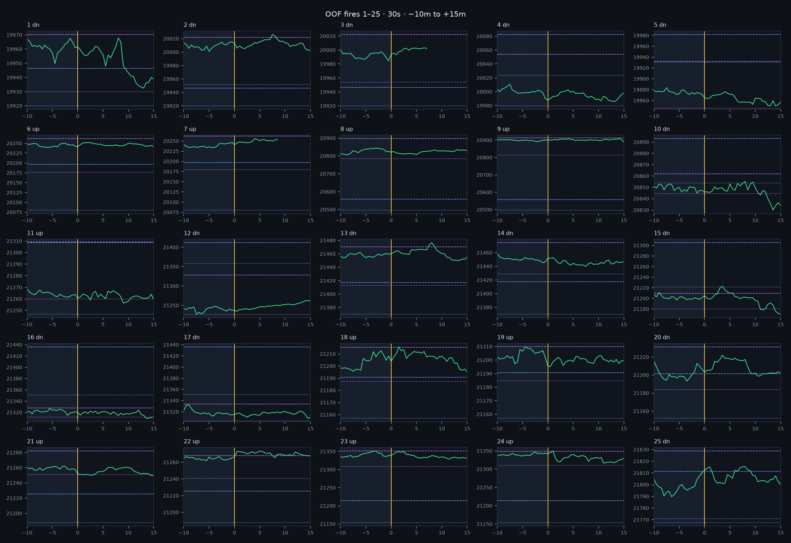
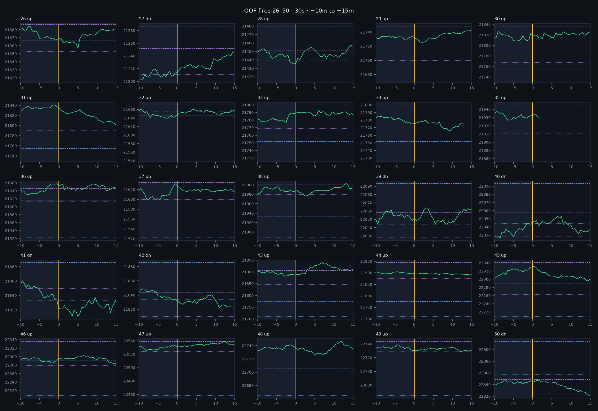
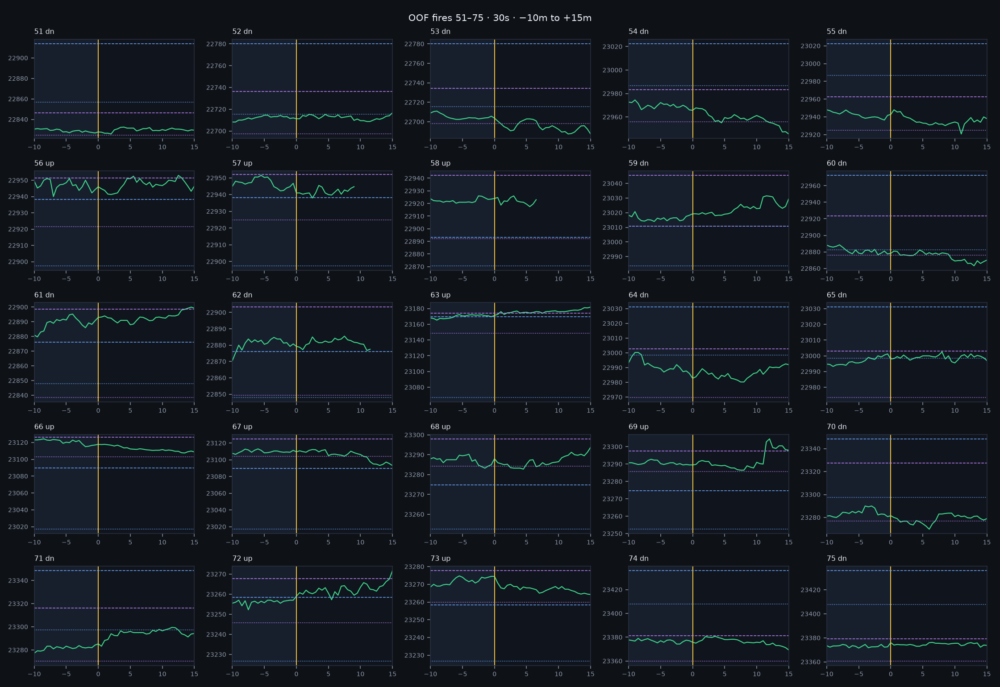
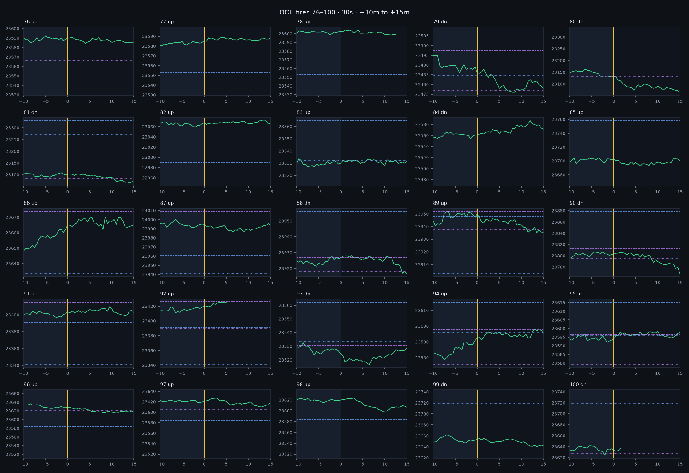

# 100 إطلاق OOF على فريم 30 ثانية

عينة موزّعة على السنة (ليس أول 100 صفقة من نفس القصة).
الخط الذهبي = الدخول. الأخضر = الإغلاق. الأزرق = آسيا. البنفسجي = قرار لندن.
المسار بعد الدخول للعين فقط.

## صفقات 1–25

## صفقات 26–50

## صفقات 51–75

## صفقات 76–100

